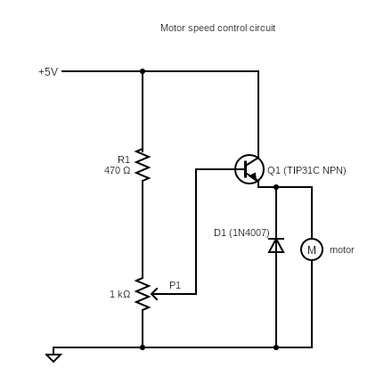

# Project: Build a USB fan to keep cool

#ID:23107
---
When you feel hot during summer months, this project will help you keep cool as it is a simple USB driven simple fan circuit you can power using ordinary USB battery pack/bank or your computer with a USB connector.

This is not a ready kit so you will need to get the parts separately. Fortunately, you do not need many of them and here is the list of items you will need if you would like to build one (or maybe even more !) to keep you cool during hot summer months. (Direct links to purchase each item are also included for you)

**LIST OF COMPONENTS TO BUILD THIS PROJECT**

**[1 - 14 AWG wire (for supporting the fan)][1]**

**[2 - USB A connector and enclosure kit][2]**

**[3 - Small electric motor with propeller][3]**

**[4 - TIP31C NPN transistor][4]**

**[5 - 1N4007 diode][5]**

**[6 - 1 kOhm potentiometer/variable resistor assortment kit][6]**

**[7 - 470 Ohm resistor][7]**

Besides the above you will need hot glue gun (***[watch our related video for help][8]***), 30 AWG general purpose wire and soldering iron, of course, which are not listed. Let us know if you need any support with those on the ***[YouTube video page][9]***.

The circuit is an easy one to build and the diagram is provided below for your reference.

Following screenshot also provides how each component looks as shown in the ***[Youtube video][9]***, which we think you will find useful while building your own version.

Project Challenges
---

The circuit is a simple one to build. However, watch the steps of construction carefully in ***[our YouTube video][9]*** to do it correctly. Also, be patient during the construction as some components may need extra attention to install as needed. Be careful with isolating the wires using the glue gun where needed to avoid any shortcircuits.

CAUTION !!
---
   
**If you run the fan for a long time at the highest speed, the Q1 transistor will heat up considerably causing the hot glue around it to soften thereby displacing the components !**

**If you intend to operate this circuit longer than 10 minutes, please do not exceed 30% of the maximum speed. If you would like to operate it at higher speeds for longer, please reach out to us on our *[YouTube video page][9]* for advice on modifications to add to this project.**

[1]: https://amzn.to/46hSLd9
[2]: https://amzn.to/44fUr4Z
[3]: https://amzn.to/3CITDKb
[4]: https://amzn.to/43TPDlX
[5]: https://amzn.to/3XpAVAR
[6]: https://amzn.to/3PtrE8Z
[7]: https://amzn.to/434KG92
[8]: https://youtu.be/pFxGGzmHM-Y
[9]: https://youtu.be/5XQ8ebEREB4
